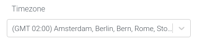
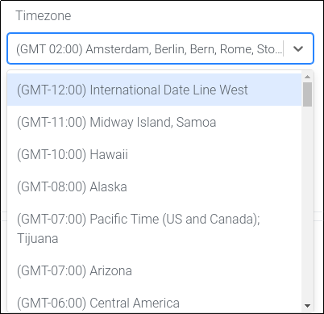
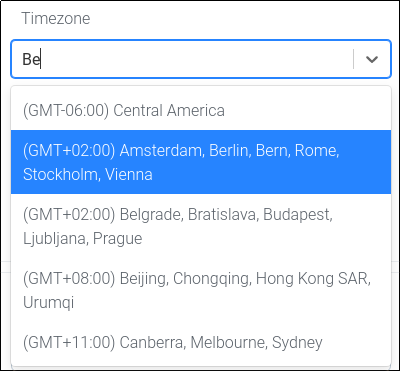

# 🌐⌚ react-timezone-select

Another react timezone select component, I know.. However this one has a few key benefits!

While looking around for a good one online, I had trouble finding timezone select components which   

**A)** Adjusted the choices with Daylight Savings Time (DST)    
**B)** Didn't have a huge list of choices when technically only 24 (ish) are necessary. 

## 🏗️ Installing

```
npm install react-timezone-select
```

## 🔭 Usage 
```
import React from 'react'
import ReactDOM from 'react-dom'
import Select from 'react-timezone-select'

class App extends React.Component {
  constructor (props) {
    super(props)
    this.state = {
      selectedOption: ''
    }
  }

  handleChange = selectedOption => {
    this.setState({ selectedOption: selectedOption })
  }

  render() {
    const {
      selectedOption
    } = this.state

    return (
      <div className="App">
        <div className="select-wrapper">
          <Select 
            value={selectedOption} 
            onChange={this.handleChange}
          />
        </div>
        <h3>{selectedOption.value} - {selectedOption.label}</h3>
      </div>
    )
  }
}

const rootElement = document.getElementById("root");
ReactDOM.render(<App />, rootElement);
```

## 🖥️ Example

Theres a small example page / implementation available in the `./examples` directory, simply run `npm start` after installing everything and webpack dev server should begin, where you will be able to find the demo at `localhost:3001`








## 🚧 Contributing

Pull requests are always welcome! Two rules:

1. Don't be a dick
2. Please use standard for linting / formatting. If you don't, I will before merge.

## 🙏 Thanks

- [Carlos Matallin](https://github.com/matallo/) + [Demo](https://codepen.io/matallo/pen/WEjKqG?editors=1010)
- [react-select](https://react-select.com)

